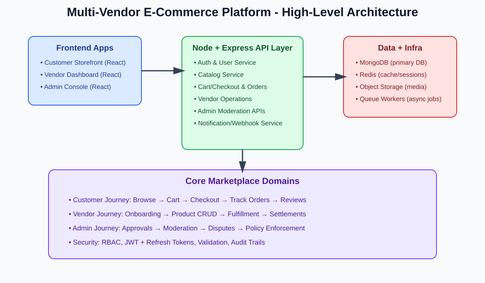
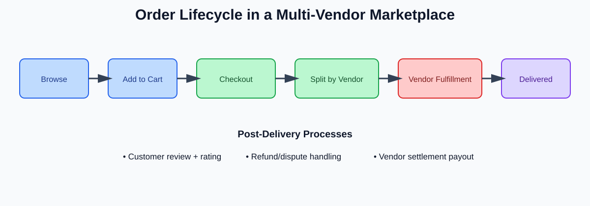

# Multi-Vendor E-Commerce Platform (MERN)

An **advanced full-stack marketplace** where multiple sellers can onboard, list products, and manage orders while customers browse, purchase, and review items.

## Stack
- **MongoDB**: Product catalog, users, orders, payouts, reviews, and audit logs.
- **Express + Node.js**: REST APIs for authentication, catalog, cart/checkout, vendor operations, and admin moderation.
- **React**: Customer storefront, vendor dashboard, and admin console.

## Why this project is trending
Marketplace systems are a strong portfolio signal because they combine:
1. **Complex domain modeling** (buyers, vendors, products, inventory, commissions, settlements).
2. **Role-based security** (customer/vendor/admin authorization boundaries).
3. **Transactional workflows** (cart, payments, order life cycle, refunds, and payouts).
4. **Scalable architecture** (search, pagination, caching, background jobs, observability).

## Visual overview

### Platform architecture

### Order lifecycle

## Production Notes
- Use a strong, rotated `JWT_SECRET`.
- Restrict CORS to trusted frontend origins only.
- Place API and web behind TLS termination.
- Add input validation, centralized error handling, and request rate limiting.
- Add payment gateway integration and async jobs for real marketplace operations.
